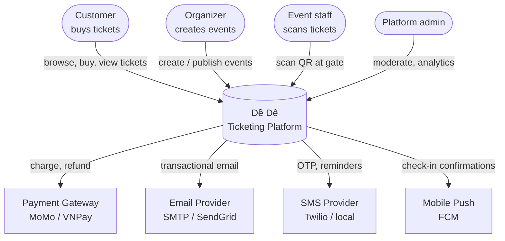
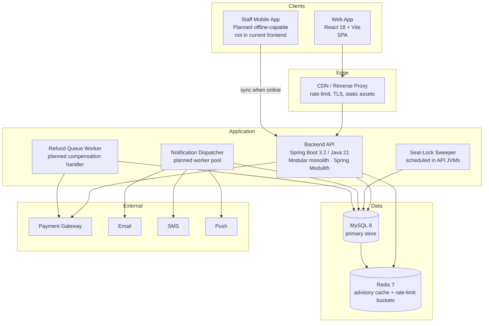
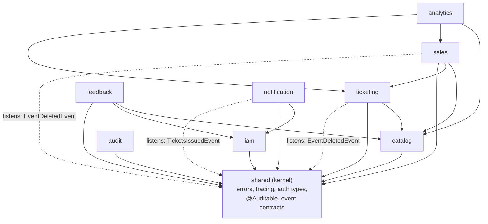
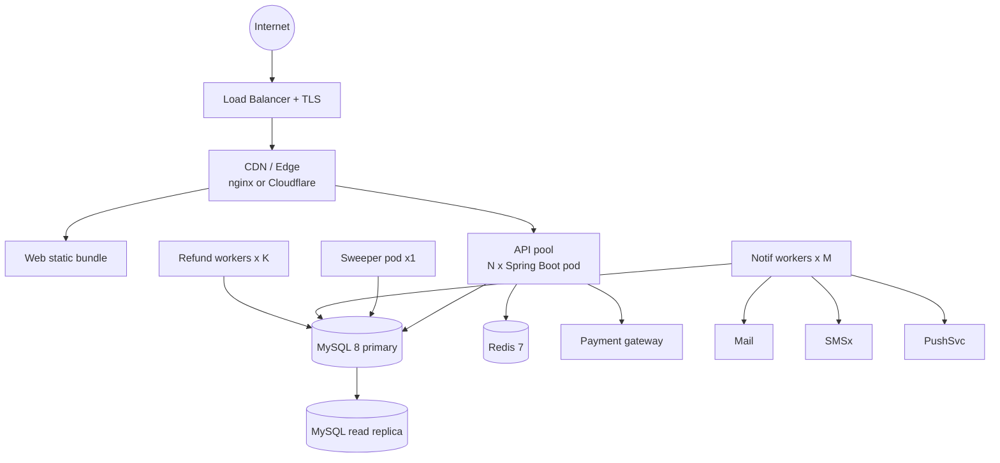

# System Architecture

> Status: Implementation snapshot — updated 2026-05-25.
> Audience: every contributor before they touch code.
> Companion docs: [`design-supplement.md`](../design/system-flows/design-supplement.md) (flow detail), [`schema-definition.md`](../engineering/database/schema-definition.md) (data), [`api/openapi.yaml`](../api/openapi.yaml) (contract), [`adr/`](../adr/) (decisions).

This document gives the single top-level picture of the system. Per-flow detail lives in `design-supplement.md`; decisions live in `adr/`. When those disagree with this doc, the ADRs win — this doc is a snapshot.

---

## 1. C4 — Level 1: System context

Who interacts with the system and what external systems we depend on.

**External dependencies** are all assumed to be unreliable. The current implementation uses a mock/simulated payment path and in-app notifications; real email/SMS/push providers, circuit breakers, and outbound retry wrappers remain future integration work.

---

## 2. C4 — Level 2: Containers

The runtime units we deploy and operate.

### Container responsibilities

| Container | Responsibility | Scaling model |
|---|---|---|
| **CDN / Edge proxy** | Static asset serving and reverse proxy today; TLS, IP-tier rate limiting, and HMAC challenge gate are planned | Managed (Cloudflare / nginx) |
| **Web App** | Customer-facing SPA, organizer dashboard, admin console | Static, served from CDN |
| **Staff Mobile App** | Planned offline QR scan + sync; not present in the current React frontend | One install per staff device |
| **Backend API** | All HTTP request handling; stateless except for Redis token-bucket cache | Horizontal — N replicas behind LB |
| **Sweeper** | Releases expired `EVENT_SEATS` locks every 30s | Currently scheduled in each API replica; duplicate sweeps are idempotent, but ADR-0010's DB advisory lock is not implemented yet |
| **Notification Dispatcher** | Planned drain of `NOTIFICATIONS` table to email/SMS/push | Not implemented; notifications are currently stored as in-app rows |
| **Refund Queue Worker** | Planned "PAID but ticket-issue failed" compensation | Not implemented |
| **MySQL 8** | Source of truth for all domain data | Vertical first; read replicas if needed |
| **Redis 7** | Token buckets, advisory seat-availability cache, idempotency-key store | Single primary + replica |

### Why a monolith for Sprint 1

ADR-0001 captures the reasoning. Short version: a single Spring Boot deployable is easier to test, easier to reason about for golden-hour load, and keeps transactions in-process (the seat-lock + order + ticket-issue path is one transaction). Microservices come back on the table if specific bottlenecks demand it.

---

## 3. C4 — Level 3: Components inside the backend

The backend is a **Spring Modulith** application: one deployable, sliced by **business
capability** into 9 modules + a shared kernel (direct sub-packages of
`com.odoomaster.ticketing`), with boundaries **enforced at build time**. See
[ADR-0011](../adr/0011-spring-modulith.md), [ADR-0012](../adr/0012-named-interfaces.md)
and the [module docs](modulith/) (C4 diagrams + per-module canvas + facet table).

Entities, repositories and impls are hidden in a **`…​.internal`** sub-package. Of what
remains, a module exposes across boundaries only the types annotated
**`@NamedInterface`**, and each consumer declares the exact facets it uses —
`allowedDependencies = "catalog::events"`. So cross-module calls go through published
APIs (`EventCatalog`, `SeatInventory`, `TicketIssuance`, `SalesReporting`,
`TicketingReporting`, `UserDirectory`) or `shared` events — never a foreign repository,
and never another module's controllers, DTOs or internal services.

| Module | Owns | Publishes (named interfaces) |
|---|---|---|
| `shared` | error envelope, `TraceIdFilter`, `AuthPrincipal`/`@CurrentUser`, `@Auditable`, event contracts | `::errors`, `::security`, `::audit`, `::contracts` |
| `iam` | users, roles, JWT auth, `SecurityConfig` | `::directory` (`UserDirectory`) |
| `catalog` | events, categories, ticket types, seats/venues, seat-lock sweeper, caches | `::events` (`EventCatalog`), `::inventory` (`SeatInventory`) |
| `ticketing` | tickets, gate check-in | `::issuance` (`TicketIssuance`), `::reporting` (`TicketingReporting`) |
| `sales` | orders, payments, retry loop | `::reporting` (`SalesReporting`) |
| `notification` | in-app notifications | — |
| `feedback` | ratings/reviews | — |
| `analytics` | admin dashboards (composes reporting APIs) | — |
| `audit` | `@Auditable` audit trail (AOP) | — |

`catalog` never depends on `sales`/`ticketing`; three **cycle-breakers** keep it clean —
catalog-local revenue (`Σ SOLD seat price`), a catalog-local DRAFT-revert guard, and a
delete cascade via `shared:EventDeletedEvent` that `sales`/`ticketing` listen for.

**Within a module** the classic lifecycle still holds: filters → controller (thin,
DTO ↔ domain) → service (`@Transactional`, one logical unit of work) →
`internal` repository (Spring Data JPA) → `internal` entity → MySQL. Controllers never
touch repositories directly; the ordering hot path spans `sales → catalog → ticketing`
inside **one** transaction, so ACID and seat-lock semantics are unchanged.

**Boundaries are a test:** `ModularityTests` runs `ApplicationModules.verify()` (static
analysis, no context/DB) and fails the build on any cycle or undeclared cross-module
dependency.

**Cross-cutting concerns**

| Concern | Where it lives |
|---|---|
| AuthN (JWT validation) | `iam/internal/JwtAuthenticationFilter` |
| AuthZ (RBAC) | `iam/internal/SecurityConfig` request matchers + selected `@PreAuthorize`; resource-level organizer ownership checks are partial |
| Rate limiting | Planned Redis token bucket; not implemented |
| Idempotency | ADR exists, but no Idempotency-Key filter/table is implemented yet |
| Tracing | `shared/TraceIdFilter` → MDC `traceId` per request, propagated to logs |
| Validation | Jakarta Bean Validation on DTOs |
| Error mapping | `shared/GlobalExceptionHandler` → standard error envelope (see `api/conventions.md`) |
| Audit | `audit/AuditAspect` matches `shared/@Auditable` via AOP |

---

## 4. Critical runtime paths

These are the paths that drive most architectural choices. Each has a detailed sequence diagram in `design-supplement.md`.

| Path | Why it's critical | Reference |
|---|---|---|
| Seat lock acquisition | Golden-hour race-loser correctness | §1 in design-supplement |
| Seat-lock expiry sweep | Prevents oversell / undersell from abandoned carts | §2 |
| Order → Payment → Ticket | "Charged but no ticket" is the highest-risk failure mode | §3 |
| Staff check-in scan | Prevents duplicate QR use at the gate | §4 |
| Offline check-in sync | Planned mobile flow; backend currently exposes online `POST /v1/tickets/scan` only | §4 |
| Rate-limit + HMAC challenge | Planned bot mitigation during sales open | §5 |

---

## 5. Deployment topology (Sprint 1 target)

### Capacity targets (from `GE-REQUIREMENT.md`)

| Target | Value | Source |
|---|---|---|
| Concurrent users | 10 000 | NFR §2.4 |
| Tickets per event | 50 000 | NFR §2.4 |
| Response time p95 | < 2 s | NFR §2.4 |
| Availability | 99.5 % | NFR §2.4 |

Verification belongs to the [load-test plan](../quality/nfr-load-test-plan.md), not this document.

### Current Docker load-balancing topology

`docker-compose.yml` runs four Spring Boot backend containers (`backend1` through `backend4`) behind `lb/nginx.conf`. Nginx uses `least_conn`, backend health checks, keepalive upstream connections, and bounded upstream retries for transient 502/503/504 errors. State-changing requests are not silently replayed by nginx; client-visible retries must use the application idempotency contract.

---

## 6. Environments

| Env | Purpose | Profile | DB | Notes |
|---|---|---|---|---|
| `dev` | Local laptop | `dev` | MySQL via Docker Compose | `ddl-auto: update`, SQL logging on |
| `test` | CI | `test` | Testcontainers MySQL | Flyway runs from clean DB each pipeline |
| `staging` | Pre-prod, load-test target | `prod` | Managed MySQL | Mirrors prod config; payment in sandbox mode |
| `prod` | Live | `prod` | Managed MySQL + replica | `ddl-auto: validate`; migrations only via Flyway |

See `docs/engineering/environment.md` for env-var details and `docs/engineering/database/migration-strategy.md` for the migration tool decision.

---

## 7. Architecture invariants (what reviewers should reject)

These are not style nits — violating any of them breaks correctness or NFR targets:

1. **DB is source of truth for seat status.** Redis is advisory only; the `WHERE status='AVAILABLE' AND version=:v` clause stays in every seat UPDATE.
2. **One transaction per logical unit of work.** Seat-lock + order + payment-record write must commit or roll back together where applicable.
3. **The sweeper should run in exactly one place.** Current multi-replica compose still schedules it in every API JVM; this is an open ADR-0010 follow-up. No sweep code should be added to API request handlers.
4. **`ORDER_ITEMS.event_seat_id` `UNIQUE` constraint stays.** It is the last line of defense against double-booking.
5. **`TICKETS.qr_code` `UNIQUE` constraint stays.** No duplicate QRs ever.
6. **Idempotency-Key must be added before real client retries are supported.** The ADR is accepted, but the implementation is still missing.
7. **All external calls must have timeouts.** Real external provider clients are not wired yet; any future client must set bounded connect/read timeouts.
8. **No business logic in controllers.** Controllers map DTOs; services do work.

---

## 8. Out of scope for Sprint 1

Tracked here so we don't accidentally build them:

- Microservice decomposition
- Kafka / RabbitMQ / dedicated message broker (using `NOTIFICATIONS` table — see ADR-0004)
- Multi-region deployment
- Real-time WebSocket seat-map updates (poll every 5s instead)
- AI-driven dynamic pricing / recommendation
- Native iOS / Android customer apps (web is responsive)

When any of these come back into scope, write a new ADR — don't edit this list silently.
